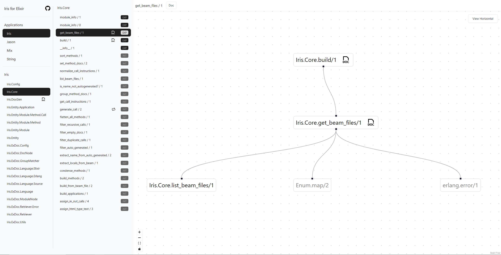

# Iris

A tool for visualizing your Elixir codebase.



The following features are implemented.

- List all Applications in elixir lib
- List all Modules in an application
- List all methods in an application
- Generate & View inbound and outbound calls from a selected method
- Click on outbound call method to expand the method and view its outbound calls
- Show Method documentation
- Show Module documentation
- Detect and denote recursive methods with a recursion icon
- Detect and denote methods that have documentation with a docs icon

## Installation

The package can be installed by adding `iris` to your list of dependencies in `mix.exs`:

```elixir
def deps do
  [
    {:iris, "~> 0.1.0"}
  ]
end
```

The docs found at <https://hexdocs.pm/iris>.

## Usage

Execute the following command after ensuring `iris` is added to your dependency list.

```
mix iris
```

For more info use the verbose flag as such:

```
mix iris -v
mix iris --verbose
```

## Contribution

If you encounter any issue, raise a github issue with a minimal example that reproduces the issue.

This project implementation can be improved a lot, pull requests that improve the codebase/address any issues are welcome.

## License

Iris source code is released under the Apache 2 License.

Any content of Iris, or any content generated by any "Derivative Works" (as specified in the Apache 2 License), must include a direct, readable, and visible link to the [Iris repository](https://github.com/rahultumpala/iris) on each rendered material.

<hr>

This project is heavily inspired by [ExDoc](https://github.com/elixir-lang/ex_doc) and uses some of its source code in generating and viewing documentation. The icon used to denote recursive methods is from [Grommet](https://seekicon.com/artist/grommet).