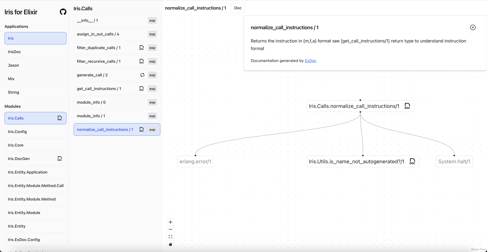

# Iris

Iris is a library to help visualize your Elixir codebase.

Iris aims to reduce the time taken to skim through an Elixir codebase by rendering an interactive GUI displaying the constituent applications, modules, functions and function call paths, even documentation!



The following features are provided:

- List all Applications, Modules, Functions in your Elixir codebase
- View inbound and outbound calls from a selected function
- Click on outbound call function to expand the function and view its outbound calls
- Display module documentation, function documentation for both public and private functions and macros
- Auto Identify recursive functions, macros.

## Installation

The package can be installed by adding `iris` to your list of dependencies in `mix.exs`:

```elixir
def deps do
  [
    {:iris, "~> 0.2.1"}
  ]
end
```

Hex package located at <https://hexdocs.pm/iris>.

## Usage

Execute the following command after ensuring `iris` is added to your dependency list.

```
mix iris
```

For more verbose output use the verbose flag as such:

```
mix iris -v
mix iris --verbose
```

### To link the generated iris GUI in documentation generated by `ex_doc`:

1. Add an empty `IrisUI.md` in the root directory of the project
2. Add `IrisUI.md` to the extras section of `docs` in `mix.exs`. [See example](./mix.exs)
3. Execute `mix iris.docs`
4. You will find a link to IrisUI in the Pages section to `irisui.html`
5. In addition, you can alias `mix docs` to `mix iris.docs` to include the generated UI when publishing to hex. See `aliases` in [mix.exs](./mix.exs).

### For writing documentation on private functions and rendering it in UI:

- Iris supports adding the `@idoc` attribute prior to a private function definition. The documentation is rendered in UI in the same way ExDoc output is rendered. For example:

```elixir
defmodule Test do

use IrisDoc # this statement is needed for using @idoc

  @idoc ~S"""
    This is documentation for private functions
  """
  defp private_function() do
    ....
  end

end
```

When the `@idoc` attribute is added to any other definitions a clear error is printed as such:
```
== Compilation error in file lib/iris/core.ex ==
** (CompileError) lib/iris/core.ex: @idoc supports only private functions defined in the module. Using @idoc before `def build/1` is not supported.
    lib/iris_doc.ex:41: IrisDoc.on_definition/6
    lib/iris/core.ex:10: (module)
```

## Interactive Demo

HexDocs hosts the Iris GUI for this project! generated by `mix iris.docs`

Find the interactive UI at HexDocs -- <https://hexdocs.pm/iris/irisui.html>

## Known Limitations

- Functions passed as parameters and invoked using the dot notation are not fully supported
- Lambdas are not fully supported
- All external function calls are not rendered by default, however there should be a toggle for this in the next version of this library
  - External functions refers to Elixir/Erlang modules such as `Keyword`, `Path`, `Enum`, etc.

## Contribution

Raise a Github issue defining the problem, or open a PR. PRs are welcome!

## License

Iris source code is released under the Apache 2 License.

Any content of Iris, or any content generated by any "Derivative Works" (as specified in the Apache 2 License), must include a direct, and visible link to the [Iris repository](https://github.com/rahultumpala/iris) on each rendered material.

<hr>

This project is heavily inspired by [ExDoc](https://github.com/elixir-lang/ex_doc) and uses some of its source code in generating and viewing documentation. Documentation views contain direct, readable and visible links to the ExDoc repository as specified by the license. The icon used to denote recursive functions is from [Grommet](https://seekicon.com/artist/grommet).
